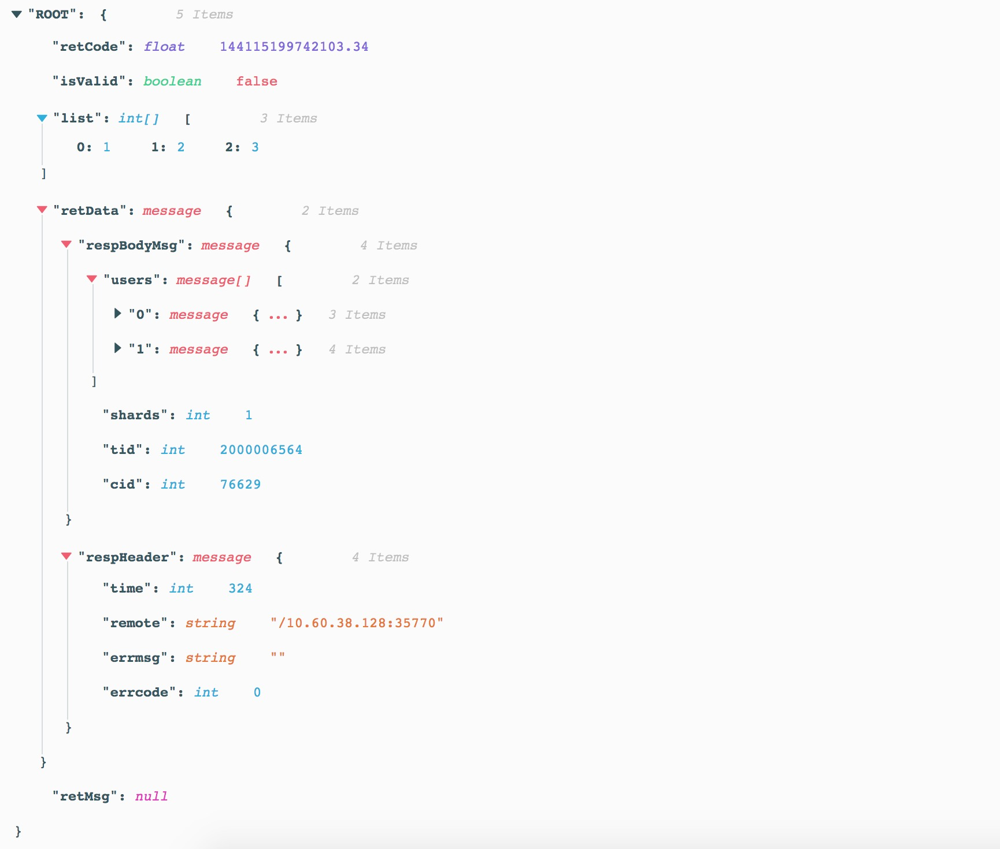

# ProtoJsonView

JsonView 组件, 配合 ProtoBuf 食用更佳


## 特性

- 支持解析包含超过JS最大范围的数字的 JSON String 到 ProtoBuf Schema
- 支持字段文档提示
- 类型高亮
- 易用的交互与 UI

## 预览



## 安装

`npm i -S proto-json-view`

## 例子

```jsx harmony
import React from 'react';
import { render } from 'react-dom';
import ProtoJsonView from '../../';

import './index.scss';


const source = '{"retCode":144115199742103.334,"isValid":false,"list":[1, 2, 3],"retData":{"respBodyMsg":{"users":[{"uid":2639271515,"class_id":0,"ts":1522659325},{"uid":144115199742103334,"class_id":0,"ts":1522728716,"uid_type":2}],"shards":1,"tid":2000006564,"cid":76629},"respHeader":{"time":324,"remote":"/10.60.38.128:35770","errmsg":"","errcode":0}},"retMsg":null}';

const App = () => (
  <ProtoJsonView
    src={source}
    collapsed={false}
    rootName="ROOT"
  />
);

const container = document.createElement('div');
document.body.appendChild(container);

render(<App />, container);
```

## PropTypes

- **src: String | Array | Object** Field infos  
- **rootName: String (Optional)** Displayed name of root node  
- **collapsed: Boolean | Int (Optional)** "True" to collapse all nodes; "False" to expand all nodes, number to expand nodes with the specified nested depth  
- **mode: "proto" | "json" (Optional)** Use it as ordinary JsonView by passing "json"
